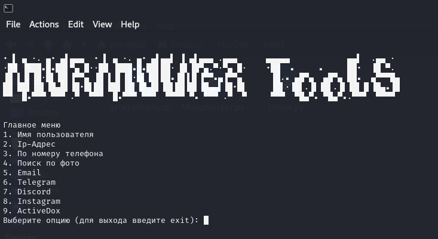

# MurOsint-Tools FOR LINUX ONLY
Объединяет в себе функционал моих собственных инструментов с другими популярными программами, обеспечивая широкий спектр возможностей по сбору открытой информации.
Проект включает следующие файлы:

 generalmenu.py: Модуль для создания общего меню и управления различными функциями утилит.
 phone.py: Утилита для поиска информации о номерах телефонов.
 Muriptracker.py: Утилита для отслеживания информации об IP-адресах.

Установка и запуск:
Установка библиотек:
1)Перед запуском убедитесь, что у вас установлены необходимые библиотеки Python. Если они отсутствуют, выполните установку следующей командой:
pip install requests
2)Запуск:

Скачайте все файлы проекта в одну директорию.
Запустите файл python3 generalmenu.py.
Примечание:
Проект был протестирован на операционной системе Kali Linux и должен работать корректно. Если у вас возникли проблемы с запуском или использованием утилит, обратитесь ко мне для получения помощи.

just for educational purposes, so i am not responsible for its use
